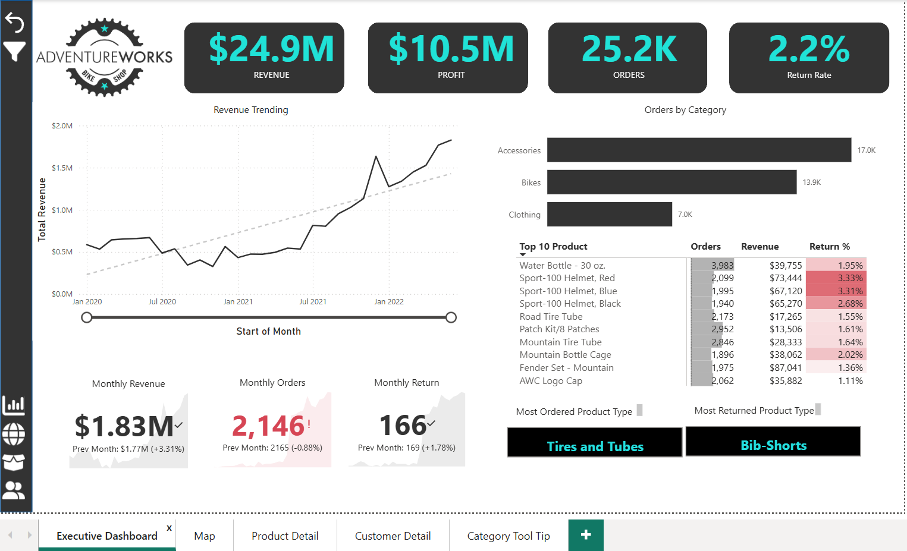
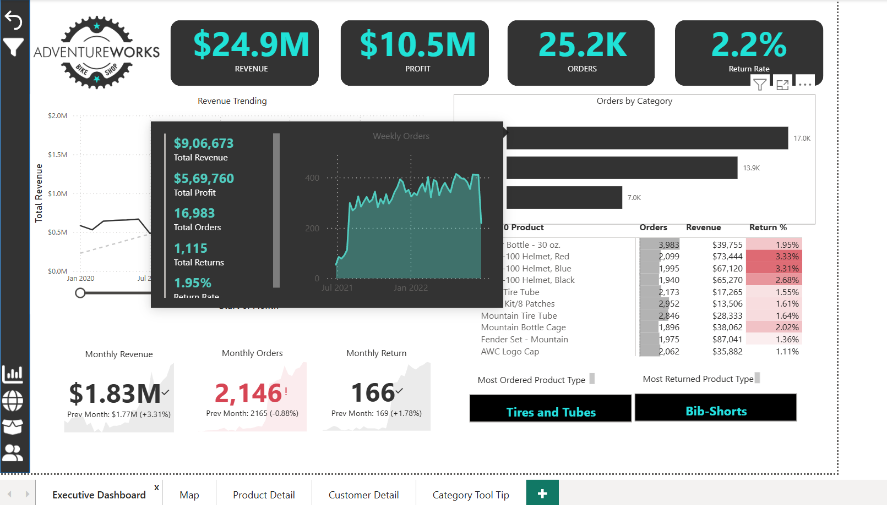
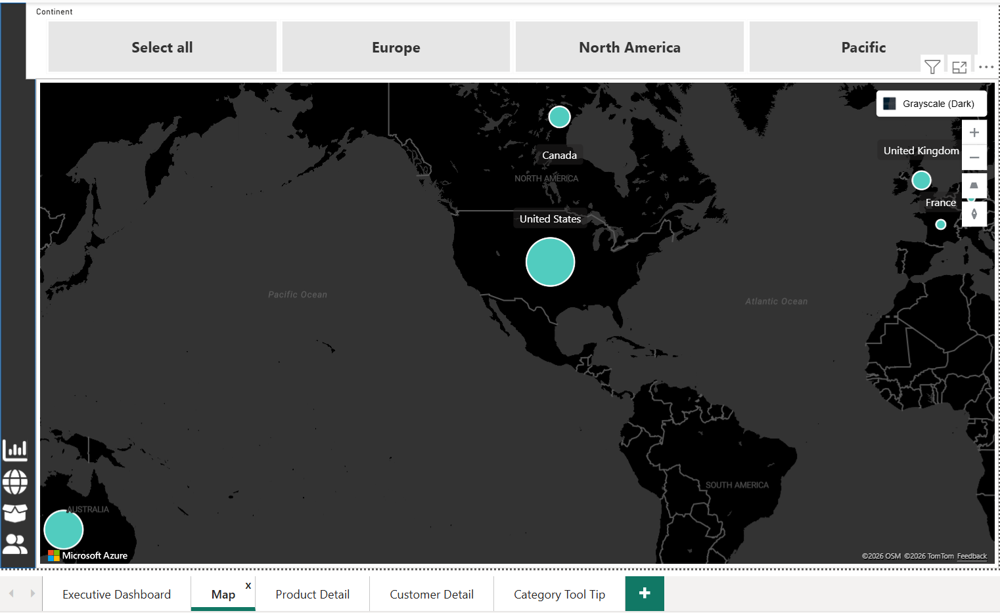
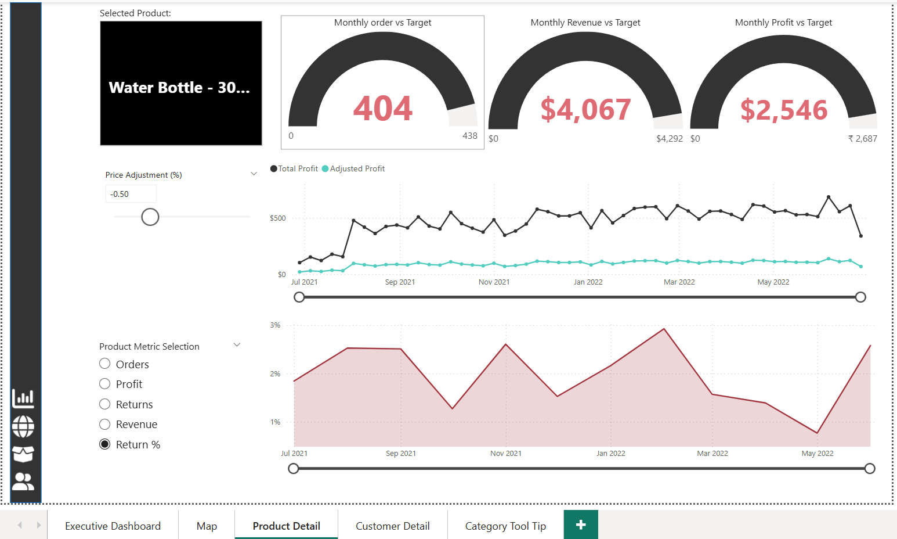
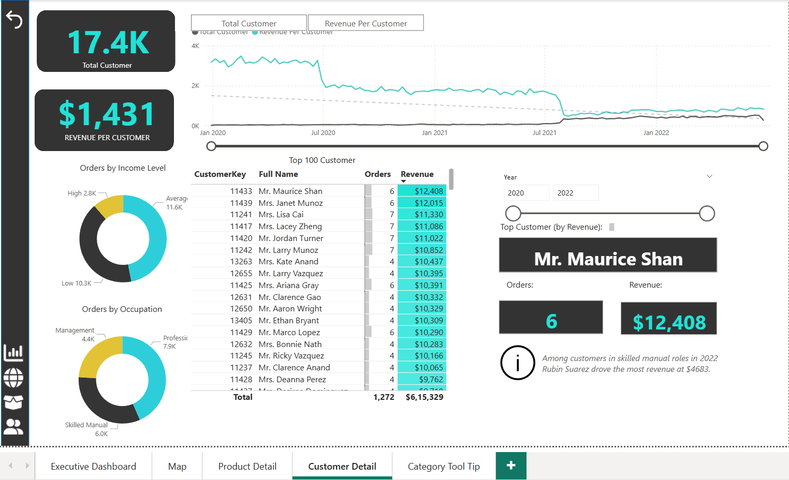
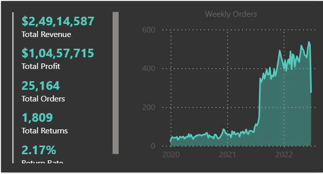

# AdventureWorks Operational Intelligence Suite

A high-performance Power BI solution transforming raw data into executive-ready insights. This project demonstrates end-to-end proficiency in data modeling, advanced DAX engineering, and interactive storytelling.

## 🚀 Business Impact
* **Automated Reporting:** Streamlined MIS workflows, reducing manual turnaround time by **30%**.
* **Data Hygiene:** Achieved 100% accuracy via rigorous data reconciliation within the Star Schema model.
* [cite_start]**Executive Visibility:** Unified source of truth for **$24.9M Revenue**, **$10.5M Profit**, and **25.2K Orders**.

## 📊 Dashboard Portfolio
*To view the live interactive version, [Click Here](https://app.powerbi.com/reportEmbed?reportId=79103e85-2c5b-4ce9-8f55-4897d1988130&autoAuth=true&ctid=9a1fb666-49b5-49f9-a380-19890caa812a).*

### 1. Executive Summary

*Tracks high-level KPIs and monthly revenue trends ($1.83M current month).*
Category-Specific Insights (Tooltip)

*Dynamic hover-over tooltips providing granular weekly order trends and return rates (2.17% average) for specific product categories without cluttering the main interface.*

### 2. Geographic Sales Analysis

*Spatial analysis of distribution across North America, Europe, and the Pacific.*

### 3. Product Performance & What-If Analysis

*Features performance gauges vs. targets and interactive price adjustment modeling.*

### 4. Customer Segmentation

*Deep-dive into 17.4K customers by occupation and income level.*

### 5. Advanced Interactivity (Category Tooltip)

*Custom report-page tooltips providing granular hover-over insights into weekly trends.*

## 🛠️ Technical Stack
* **Power BI Desktop:** Star Schema modeling and advanced visualization.
* **DAX:** Engineered measures for YoY growth, performance vs. targets, and rolling averages.
* **Excel:** Initial data auditing and variance analysis.
* **Power BI Service:** Managed workspace governance and public deployment.

## 📂 Project Structure
* `AdventureWorks_Report.pbix`: Technical source file.
* `Adventure Work Dax Formula.xlsx`: Log of logic and measures.
* `AdventureWorks_Report_Overview.pdf`: 5-page static export.

---
**Contact:** Ambika Dubey | 
[LinkedIn Profile](https://www.linkedin.com/in/ambika-dubey-141153184/)

